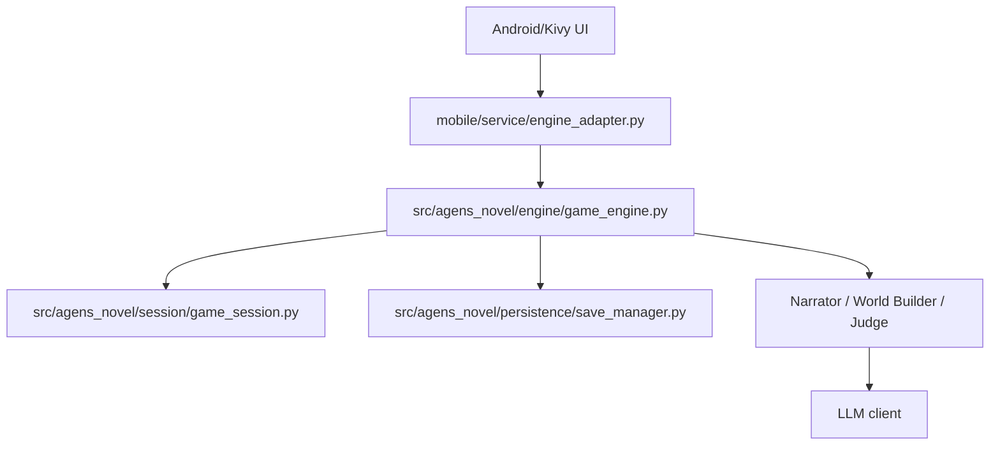

# Android-Only Architecture

## Scope

`agens-novel` is an Android/Kivy text cultivation simulator. The product path is Android-only. Terminal REPL and CLI surfaces have been removed from the supported architecture.

## Runtime Layers

## Key Modules

- `mobile/main.py`: Kivy app entry and Buildozer runtime entry.
- `mobile/screens/home_screen.py`: home screen, settings, save loading, tutorial popups.
- `mobile/screens/character_create_screen.py`: character creation.
- `mobile/screens/game_screen.py`: main gameplay, tool sheet, save/load dialogs.
- `mobile/screens/death_screen.py`: death and ascension finale.
- `mobile/widgets/action_bar.py`: bottom `更多 + D input + 发送` bar.
- `mobile/widgets/narrative_view.py`: narrative stream and A/B/C choices.
- `mobile/widgets/status_bar.py`: compact character state.
- `mobile/widgets/combat_bar.py`: compact combat status only.
- `mobile/assets/images/`: final UI images for mountain gate, paper texture, death path, and ascension gate.
- `src/agens_novel/engine/game_engine.py`: unique game logic entrypoint.
- `src/agens_novel/engine/turn_runner.py`: Agent invocation.
- `src/agens_novel/session/game_session.py`: state, delta application, serialization.
- `src/agens_novel/persistence/save_manager.py`: save/load.
- `src/agens_novel/game/realm.py`: realm and breakthrough rules.
- `src/agens_novel/game/combat.py`: combat state machine.

## Gameplay Contract

- A/B/C are model-generated choices based on current context.
- D is always the player typed action.
- If model choices are absent or the LLM fails, the engine emits the visible fallback notice and uses grounded fallback choices.
- Major breakthroughs require experience, insight, and lightweight preparation flags.
- Repeated pure cultivation may progress minor layers but cannot trivially satisfy major breakthrough gates.
- Combat actions are natural language input; permanent combat buttons are not part of the UI.
- Death and ascension are separate terminal states.

## Build Contract

- Android portrait is the only supported product target.
- `mobile/buildozer.spec` must include Python, image, font, JSON/YAML/text, and audio asset extensions used by `mobile/assets/` and project root BGM.
- API keys are runtime configuration only and must not be written to source files or docs.
