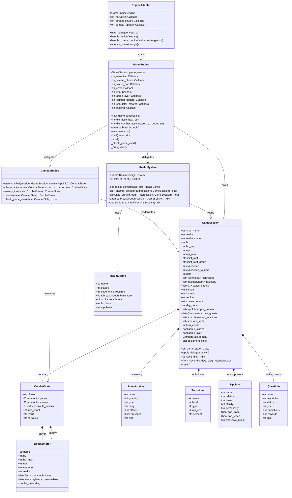
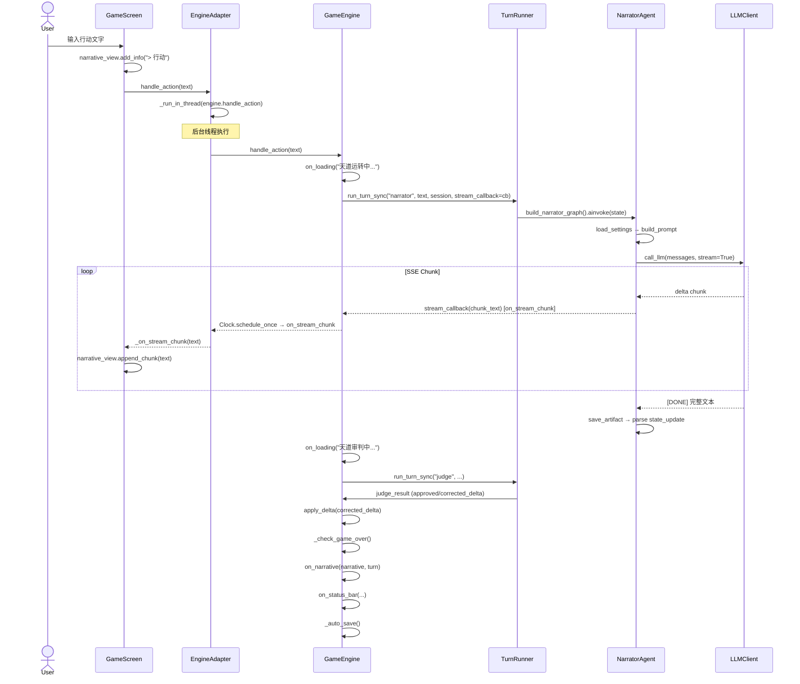
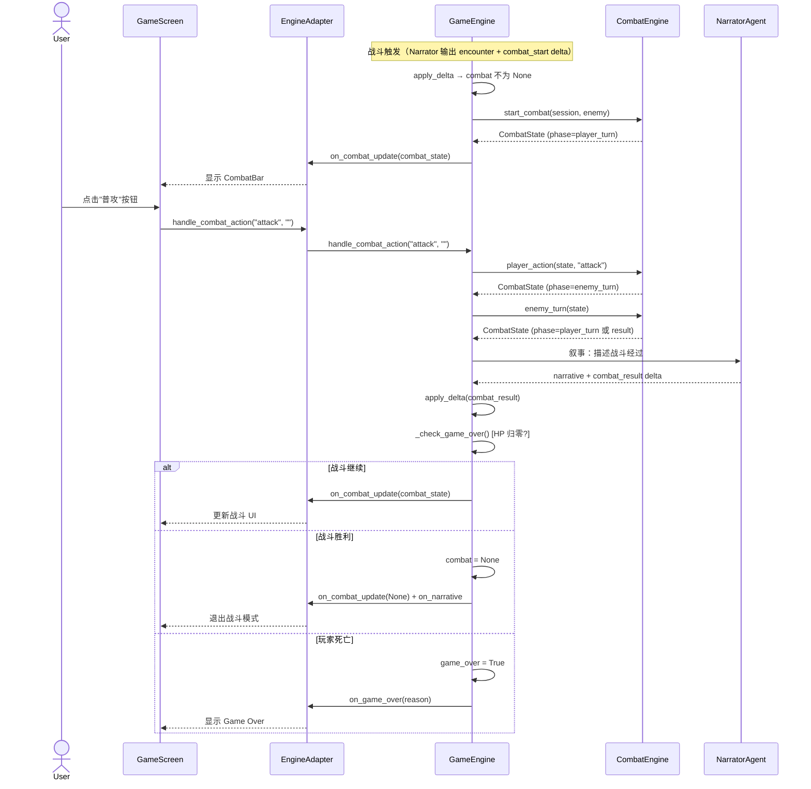
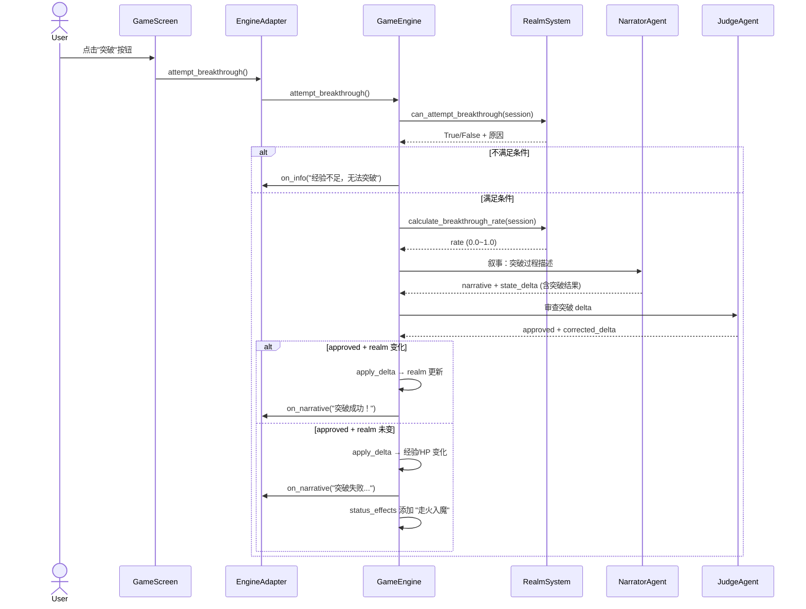
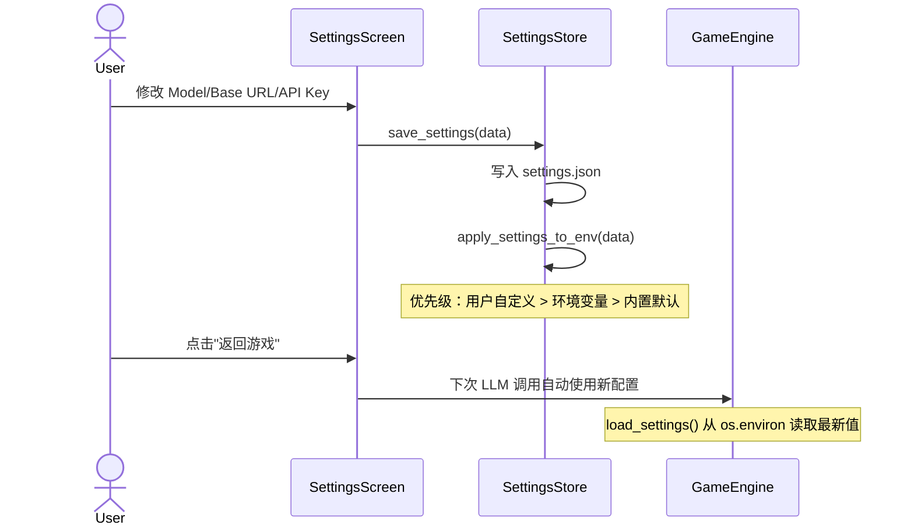
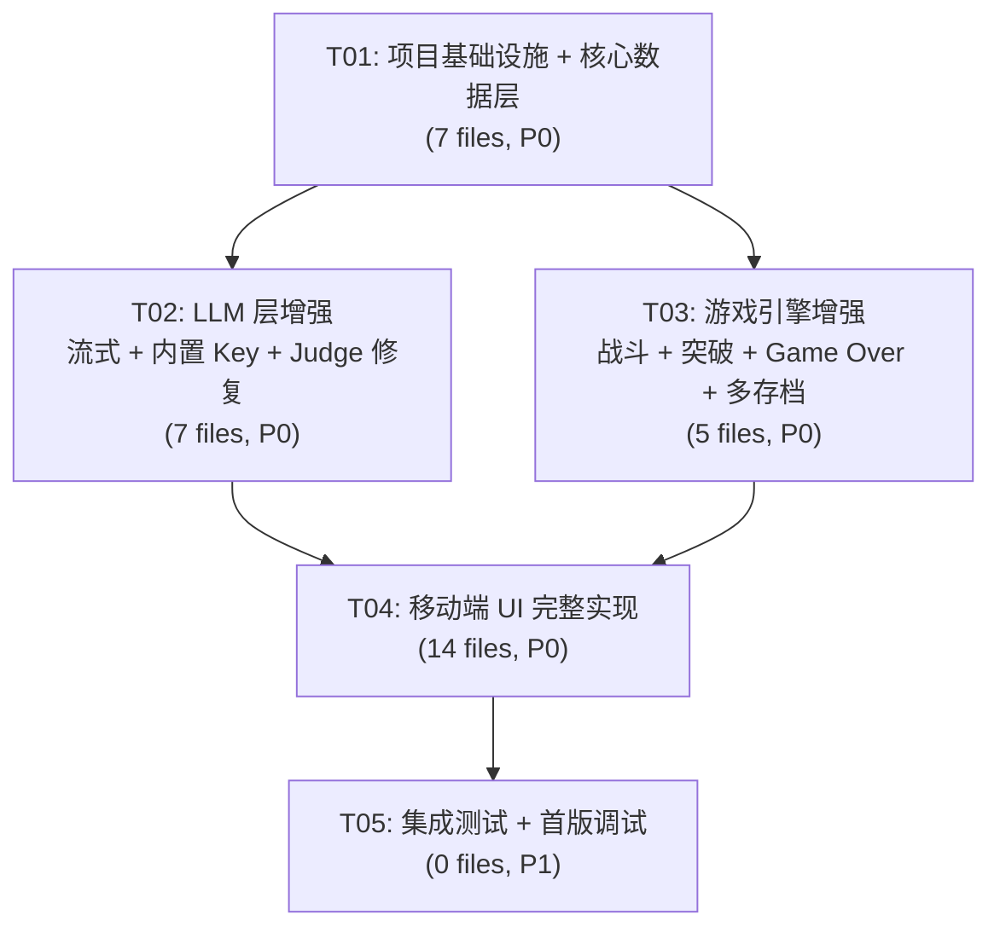

# AI 修仙模拟器 — 系统架构设计文档

> **项目**: agens-novel v0.3.0 (移动端可玩版本)
> **架构师**: 高见远 (Gao)
> **日期**: 2025-07-14
> **状态**: Draft v1

---

## 目录

1. [实现方案 + 框架选型](#1-实现方案--框架选型)
2. [文件列表](#2-文件列表)
3. [数据结构和接口（类图）](#3-数据结构和接口类图)
4. [程序调用流程（时序图）](#4-程序调用流程时序图)
5. [待明确事项](#5-待明确事项)
6. [依赖包列表](#6-依赖包列表)
7. [任务列表](#7-任务列表)
8. [共享知识（跨文件约定）](#8-共享知识跨文件约定)
9. [任务依赖图](#9-任务依赖图)

---

## 1. 实现方案 + 框架选型

### 1.1 核心技术决策

| 决策项 | 选择 | 理由 |
|--------|------|------|
| 移动端框架 | **Kivy** (沿用) | PRD 已确认，现有骨架可复用 |
| AI Agent 框架 | **LangGraph** (沿用) | 现有 3 Agent 已基于此实现，稳定运行 |
| LLM 客户端 | **httpx + SSE** (沿用 + 启用流式) | 已有 `sse.py` 实现，仅需启用 `stream=True` |
| 数据模型 | **TypedDict + dataclass** (沿用) | 现有 `GameState`/`GameSession` 已成型，增量扩展 |
| 线程桥接 | **threading + Clock.schedule_once** (沿用) | 已验证 Kivy + asyncio 共存方案 |
| 存档格式 | **JSON** (沿用) | alpha 阶段允许破坏性升级 |
| 配置持久化 | **JSON** (沿用 settings_store) | 移动端无环境变量，JSON 是唯一选择 |

### 1.2 核心技术挑战与方案

#### 挑战1: 流式叙事 (SSE → Kivy UI 逐字显示)

**问题**: 当前 `call_agnes_llm` 使用 `stream=False`，整段返回。移动端需逐字流出叙事文本，且 `run_turn_sync` 使用 `asyncio.run()` 阻塞线程，无法在流式过程中回调 UI。

**方案**:
1. 在 `narrator/nodes.py` 的 `call_agnes_llm` 中启用 `stream=True`
2. 新增 `call_llm_stream` 异步生成器，每个 SSE chunk 通过回调实时推送到 UI
3. 在 `EngineAdapter` 中新增 `on_stream_chunk(text: str)` 回调，通过 `Clock.schedule_once` 调度到 Kivy 主线程
4. `NarrativeView` 新增 `append_chunk(text)` 方法，逐字追加到当前 Label 而非一次性替换
5. 流结束后仍走 Judge → apply_delta 路径

**关键**: 流式回调不在 LangGraph 节点内，而是在 `_call_stream` 循环中直接 emit。LangGraph 的 `call_agnes_llm` 节点改为：流式收集完整文本 + 同时推 chunk 回调。

#### 挑战2: Agens API Key 内置

**问题**: 移动端无环境变量，首次启动无 Key 会阻断流程。

**方案**:
1. 在 `llm/client.py` 的 `_resolve_config` 中新增硬编码默认 Key
2. 优先级: `用户自定义(settings.json)` > `环境变量(AGNES_API_KEY)` > `内置默认`
3. 内置 Key 以混淆方式存储（base64 编码），运行时解码
4. `SettingsScreen` 不再要求必须输入 Key，内置 Key 可直接使用
5. `GameEngine._has_api_key()` 始终返回 True（内置 Key 保底）

#### 挑战3: 回合制战斗系统

**问题**: 需要在 AI 叙事框架内嵌入数值化战斗逻辑。

**方案（半结构化）**:
1. 新增 `CombatState` TypedDict，包含敌我状态、当前阶段、可用操作
2. 战斗状态机: `idle → player_turn → enemy_turn → resolve → idle/game_over`
3. `GameSession` 新增 `combat` 字段（None 或 CombatState）
4. Narrator prompt 在战斗场景下指导输出 `<combat_result>` 结构化数据
5. Judge 审查战斗数值合理性
6. `GameEngine.handle_combat_action()` 处理玩家战斗操作
7. 移动端新增 `CombatBar` 组件（普攻/功法/丹药/防御/逃跑）

#### 挑战4: 境界体系扩展

**问题**: 现有仅 5 境界（练气→化神），PRD 要求首版覆盖前 5 境界但数据结构预留 9 境界。

**方案**:
1. `GameSession.REALM_ORDER` 扩展为 9 境界完整列表
2. 新增 `RealmConfig` 常量字典，定义每境界的阶段数、突破条件、失败概率
3. 首版实现前 5 境界的完整突破逻辑，后 4 境界仅数据定义
4. `GameEngine.attempt_breakthrough()` 新方法处理突破判定
5. Narrator/Judge prompt 更新，覆盖完整境界规则

#### 挑战5: Judge 解析失败不自动批准

**问题**: 当前 `_parse_judge_output` 在 JSON 解析失败时返回 `approved=True`，等同于放行。

**方案**:
1. 修改默认返回值为 `approved=False`
2. 解析失败时 `judgment_note = "Judge 输出无法解析，拒绝状态更新"`
3. `GameEngine.handle_action()` 中若 `approved=False` 且 `corrected_delta` 为空，则跳过 delta 应用
4. 向用户展示提示："天道审判未通过，行动结果暂不生效"

### 1.3 架构模式

沿用现有 **回调驱动 + 分层** 架构:

```
┌──────────────────────────────────────────────────┐
│                  Kivy UI 层                       │
│  (Screens, Widgets, Layouts)                      │
├──────────────────────────────────────────────────┤
│              EngineAdapter (线程桥接)              │
├──────────────────────────────────────────────────┤
│              GameEngine (游戏逻辑)                 │
├──────────────────────────────────────────────────┤
│    LangGraph Agents   │   GameSession (状态)      │
│  (narrator/judge/wb)  │   (dataclass)            │
├──────────────────────────────────────────────────┤
│           LLM Client (httpx + SSE)               │
├──────────────────────────────────────────────────┤
│        Persistence (JSON saves/settings)          │
└──────────────────────────────────────────────────┘
```

---

## 2. 文件列表

### 2.1 需要修改的现有文件

| 文件路径 | 修改内容 |
|----------|---------|
| `src/agens_novel/state/game_schema.py` | 扩展 InventoryItem/NpcInfo/QuestInfo/Technique/CharacterState/WorldState/GameState TypedDict |
| `src/agens_novel/state/reducers.py` | 新增战斗相关 reducer |
| `src/agens_novel/repl/game_session.py` | 扩展 GameSession dataclass（战斗/境界/装备/NPC 好感度等字段），更新 apply_delta/to_save_dict/from_save_dict |
| `src/agens_novel/engine/game_engine.py` | 新增 handle_combat_action/attempt_breakthrough/HP 归零检测，修改 handle_action 支持 game_over 逻辑，集成流式回调 |
| `src/agens_novel/engine/render.py` | 新增 format_combat/format_realm/format_equipment 等渲染函数 |
| `src/agens_novel/llm/client.py` | 新增 call_llm_stream 生成器，修改 _resolve_config 支持内置 Key |
| `src/agens_novel/agents/narrator/nodes.py` | call_agnes_llm 启用 stream=True，新增流式回调支持 |
| `src/agens_novel/agents/judge/nodes.py` | 修改 _parse_judge_output 默认 approved=False |
| `src/agens_novel/repl/save_manager.py` | 新增多槽位支持（list_saves/delete_save/rename_save） |
| `src/agens_novel/repl/turn_runner.py` | 支持流式回调参数透传 |
| `mobile/main.py` | 新增更多 Screen 注册，启动时内置 Key 注入 |
| `mobile/screens/game_screen.py` | 集成 CombatBar/LoadingOverlay/流式叙事/Game Over 流程 |
| `mobile/screens/settings_screen.py` | 增强：模型切换 UI、内置 Key 状态提示 |
| `mobile/service/engine_adapter.py` | 新增 on_stream_chunk/on_combat_update 回调，集成战斗/突破 API |
| `mobile/widgets/narrative_view.py` | 新增 append_chunk 逐字追加，流式叙事动画 |
| `mobile/widgets/status_bar.py` | 扩展显示境界/灵根/装备位 |
| `mobile/widgets/action_bar.py` | 新增战斗模式按钮组 |
| `mobile/service/settings_store.py` | 新增模型配置持久化（user_model.json） |
| `config/default.yaml` | 扩展 realm_order 为 9 境界，新增战斗/突破配置 |
| `config/prompts/system/narrator.md` | 更新：战斗结构化输出、境界突破、NPC 好感度、装备/任务增强 |
| `config/prompts/system/judge.md` | 更新：战斗数值审查、境界突破规则、NPC 合理性检查 |
| `config/prompts/system/world_builder.md` | 更新：灵根 8 种类型、NPC 性格/可教授/可交易、任务类型 |

### 2.2 需要新增的文件

| 文件路径 | 用途 |
|----------|------|
| `src/agens_novel/game/combat.py` | 战斗系统核心：CombatState、CombatEngine、战斗状态机 |
| `src/agens_novel/game/realm.py` | 境界系统：RealmConfig、突破判定、灵根效果 |
| `src/agens_novel/game/constants.py` | 游戏常量：境界表、灵根表、品质等级、装备位定义 |
| `mobile/screens/save_screen.py` | 多存档槽位管理 UI |
| `mobile/screens/combat_screen.py` | 战斗界面（独立 Screen 或 GameScreen 内嵌） |
| `mobile/widgets/combat_bar.py` | 战斗操作栏组件（普攻/功法/丹药/防御/逃跑） |
| `mobile/widgets/loading_overlay.py` | 加载动画覆盖层 |
| `mobile/widgets/realm_card.py` | 境界信息卡片组件 |
| `mobile/screens/tutorial_screen.py` | 新手引导界面 |
| `config/prompts/system/combat_narrator.md` | 战斗场景叙事专用提示词 |

---

## 3. 数据结构和接口（类图）



---

## 4. 程序调用流程（时序图）

### 4.1 流式叙事流程



### 4.2 战斗回合流程



### 4.3 境界突破流程



### 4.4 模型切换流程



---

## 5. 待明确事项

| # | 事项 | 假设/建议 |
|---|------|----------|
| 1 | 内置 Agens API Key 的具体值 | 由官方提供，架构预留 `_DEFAULT_API_KEY` 常量，base64 编码存储 |
| 2 | 内置 Key 是否有调用频率/额度限制 | 假设有限制但足够正常游玩，UI 不显示额度 |
| 3 | 战斗中是否允许逃跑 100% 成功 | 假设非 Boss 战逃跑成功率 80%+，Boss 战不可逃跑 |
| 4 | NPC 好感度的初始值 | 假设中性 NPC 初始 0，友好 NPC 初始 30，敌对 NPC 初始 -30 |
| 5 | 新手引导的触发时机 | 假设首次 new_game 时自动触发，完成后标记 `tutorial_done=True` |
| 6 | 流式叙事的首 token 超时 | 假设 1.5s 超时后显示"天道沉默..."提示 |
| 7 | 多存档槽位上限 | 假设 5 个手动槽位 + 1 个自动存档 |
| 8 | 装备耐久度 | 假设首版无耐久度，简化实现 |
| 9 | 走火入魔效果持续回合数 | 假设 3-5 回合，由 Narrator/Judge 决定 |
| 10 | 灵根 8 种具体名称及效果 | 金/木/水/火/土(单灵根) + 冰/雷/风(异灵根)，具体效果在 constants.py 定义 |

---

## 6. 依赖包列表

### 新增 pip 依赖

```
# 无新增核心依赖
# 现有依赖已满足所有需求:
# - kivy: 移动端 UI
# - langgraph: Agent 编排
# - httpx: HTTP 客户端 + SSE
# - typer: CLI
# - pyyaml: 配置解析
```

> **说明**: 本项目是增量开发，所有核心依赖已存在于现有代码中。SSE 解析器 (`sse.py`) 已实现但未启用，无需新增依赖。

---

## 7. 任务列表

### T01: 项目基础设施 + 核心数据层

**描述**: 扩展数据模型和游戏常量，为所有后续任务奠定基础。修改核心 TypedDict 和 GameSession，新增游戏常量和境界系统。

| 子项 | 文件 |
|------|------|
| 扩展 InventoryItem/NpcInfo/QuestInfo/Technique/CharacterState/WorldState/GameState | `src/agens_novel/state/game_schema.py` |
| 新增战斗/境界相关 reducer | `src/agens_novel/state/reducers.py` |
| 扩展 GameSession（战斗/境界/装备/NPC好感度等新字段 + apply_delta/to_save_dict/from_save_dict） | `src/agens_novel/repl/game_session.py` |
| 新增游戏常量（境界表、灵根表、品质等级、装备位） | `src/agens_novel/game/constants.py` |
| 新增境界系统（RealmConfig、突破判定、灵根效果） | `src/agens_novel/game/realm.py` |
| 扩展 default.yaml（9 境界、战斗/突破配置） | `config/default.yaml` |
| 新增 __init__.py | `src/agens_novel/game/__init__.py` |

- **依赖**: 无
- **优先级**: P0
- **预估文件数**: 7

### T02: LLM 层增强（流式 + 内置 Key + Judge 修复）

**描述**: 启用 SSE 流式响应，内置 Agens API Key 作为 fallback，修复 Judge 解析失败自动批准问题。这是 P0 阻塞性需求的集中解决。

| 子项 | 文件 |
|------|------|
| 新增 call_llm_stream 生成器，修改 _resolve_config 支持内置 Key | `src/agens_novel/llm/client.py` |
| 启用 stream=True，新增流式回调支持 | `src/agens_novel/agents/narrator/nodes.py` |
| 修改 _parse_judge_output 默认 approved=False | `src/agens_novel/agents/judge/nodes.py` |
| 支持流式回调参数透传 | `src/agens_novel/repl/turn_runner.py` |
| 更新 Judge 提示词（战斗数值审查、境界规则、拒绝规则） | `config/prompts/system/judge.md` |
| 更新 Narrator 提示词（战斗结构化输出、境界突破、NPC 好感度） | `config/prompts/system/narrator.md` |
| 新增战斗叙事提示词 | `config/prompts/system/combat_narrator.md` |

- **依赖**: T01
- **优先级**: P0
- **预估文件数**: 7

### T03: 游戏引擎增强（战斗 + 突破 + 游戏结束 + 多存档）

**描述**: 在 GameEngine 层实现战斗系统、境界突破、HP 归零检测、多存档管理。同时扩展渲染函数。

| 子项 | 文件 |
|------|------|
| 新增 CombatEngine 战斗状态机 | `src/agens_novel/game/combat.py` |
| 新增战斗/突破/Game Over/多存档逻辑 | `src/agens_novel/engine/game_engine.py` |
| 新增 format_combat/format_realm/format_equipment 渲染 | `src/agens_novel/engine/render.py` |
| 扩展多槽位支持（list_saves/delete_save） | `src/agens_novel/repl/save_manager.py` |
| 更新 World Builder 提示词（灵根 8 种、NPC 增强、任务类型） | `config/prompts/system/world_builder.md` |

- **依赖**: T01
- **优先级**: P0
- **预估文件数**: 5

### T04: 移动端 UI 完整实现

**描述**: 完善所有 Kivy 移动端界面组件，集成流式叙事、战斗 UI、加载动画、存档管理、新手引导。

| 子项 | 文件 |
|------|------|
| 新增战斗操作栏组件 | `mobile/widgets/combat_bar.py` |
| 新增加载动画覆盖层 | `mobile/widgets/loading_overlay.py` |
| 新增境界信息卡片 | `mobile/widgets/realm_card.py` |
| 增强 NarrativeView（append_chunk 流式追加） | `mobile/widgets/narrative_view.py` |
| 增强 StatusBar（境界/灵根/装备位） | `mobile/widgets/status_bar.py` |
| 增强 ActionBar（战斗模式切换） | `mobile/widgets/action_bar.py` |
| 增强 EngineAdapter（流式/战斗/突破回调） | `mobile/service/engine_adapter.py` |
| 增强 GameScreen（集成战斗/加载/Game Over/流式） | `mobile/screens/game_screen.py` |
| 新增多存档管理 UI | `mobile/screens/save_screen.py` |
| 新增战斗界面 | `mobile/screens/combat_screen.py` |
| 新增新手引导界面 | `mobile/screens/tutorial_screen.py` |
| 增强 SettingsScreen（模型切换、内置 Key 提示） | `mobile/screens/settings_screen.py` |
| 增强 settings_store（模型配置持久化） | `mobile/service/settings_store.py` |
| 更新 main.py（新 Screen 注册、内置 Key 注入） | `mobile/main.py` |

- **依赖**: T01, T02, T03
- **优先级**: P0
- **预估文件数**: 14

### T05: 集成测试 + 首版调试

**描述**: 端到端集成验证，修复 P0 需求的交互问题，确保移动端可玩。

| 子项 | 文件 |
|------|------|
| 流式叙事端到端验证（首 token ≤1.5s） | 手动测试 |
| 战斗回合完整流程验证 | 手动测试 |
| 境界突破流程验证 | 手动测试 |
| HP 归零 → Game Over → 重新开始验证 | 手动测试 |
| 多存档保存/加载验证 | 手动测试 |
| 内置 Key 开箱即用验证 | 手动测试 |
| Judge 拒绝非法 delta 验证 | 手动测试 |
| 移动端 ANR 测试 | 手动测试 |
| 新手引导流程验证 | 手动测试 |

- **依赖**: T04
- **优先级**: P1
- **预估文件数**: 0 (纯测试任务)

---

## 8. 共享知识（跨文件约定）

### 编码规范

```python
# 1. 所有 TypedDict 使用 total=False，字段显式标注类型
class MyType(TypedDict, total=False):
    name: str
    value: int

# 2. GameSession 字段与 GameState TypedDict 字段名保持一致
#    as_game_state() 输出的 key 必须与 GameState 字段一一对应

# 3. 状态增量 (delta) 格式约定:
#    - 数值字段: 整数表示绝对值, "+N"/"-N" 表示增量
#    - 列表字段: xxx_add 表示追加, xxx 表示替换
#    - 不变化的字段不出现在 delta 中

# 4. 回调函数签名统一:
#    on_xxx(arg1, arg2, ...) -> None
#    所有回调通过 EngineAdapter 使用 Clock.schedule_once 调度到主线程

# 5. 错误处理策略:
#    - LLM 调用失败: 返回 llm_error 字符串, 不抛异常
#    - Judge 解析失败: approved=False, 阻止 delta 应用
#    - 存档读写失败: 静默失败(auto_save) 或 on_error 提示(手动)
#    - 战斗异常: 重置 combat 状态, 恢复到 idle

# 6. API Key 优先级:
#    用户自定义(settings.json) > 环境变量(AGNES_API_KEY) > 内置默认(_DEFAULT_KEY)

# 7. 日志规范:
#    - 所有 API Key 使用 mask() 脱敏
#    - 日志格式: [agent_name.node_name] message
#    - 敏感数据不写入日志
```

### 命名约定

| 类别 | 约定 | 示例 |
|------|------|------|
| 文件名 | snake_case | `combat_engine.py` |
| 类名 | PascalCase | `CombatEngine`, `RealmConfig` |
| 函数/方法 | snake_case | `attempt_breakthrough()` |
| 常量 | UPPER_SNAKE_CASE | `REALM_ORDER`, `_DEFAULT_API_KEY` |
| TypedDict 字段 | snake_case | `hp_max`, `realm_stage` |
| 回调事件 | on_xxx | `on_stream_chunk`, `on_combat_update` |
| 状态机阶段 | snake_case | `player_turn`, `enemy_turn` |

### 战斗系统约定

```python
# 战斗操作类型
COMBAT_ACTIONS = ["attack", "technique", "item", "defend", "flee"]

# 战斗阶段
COMBAT_PHASES = ["idle", "player_turn", "enemy_turn", "resolve", "victory", "defeat"]

# 装备位
EQUIPMENT_SLOTS = ["weapon", "armor", "accessory"]

# 品质等级（低→高）
RARITY_ORDER = ["凡品", "良品", "上品", "极品", "仙品"]
```

### 境界系统约定

```python
# 首版实现 5 境界，预留 9 境界
REALM_ORDER = [
    "练气", "筑基", "金丹", "元婴", "化神",  # 首版实现
    "合体", "大乘", "渡劫", "飞升",            # 预留
]

# 灵根 8 种
SPIRIT_ROOTS = [
    # 五行灵根
    {"name": "金灵根", "element": "金", "grade": "地", "cultivation_bonus": 1.2, "breakthrough_bonus": 0.05},
    {"name": "木灵根", "element": "木", "grade": "地", "cultivation_bonus": 1.2, "breakthrough_bonus": 0.05},
    {"name": "水灵根", "element": "水", "grade": "地", "cultivation_bonus": 1.2, "breakthrough_bonus": 0.05},
    {"name": "火灵根", "element": "火", "grade": "地", "cultivation_bonus": 1.2, "breakthrough_bonus": 0.05},
    {"name": "土灵根", "element": "土", "grade": "地", "cultivation_bonus": 1.2, "breakthrough_bonus": 0.05},
    # 异灵根
    {"name": "冰灵根", "element": "冰", "grade": "天", "cultivation_bonus": 1.5, "breakthrough_bonus": 0.10},
    {"name": "雷灵根", "element": "雷", "grade": "天", "cultivation_bonus": 1.5, "breakthrough_bonus": 0.10},
    {"name": "风灵根", "element": "风", "grade": "天", "cultivation_bonus": 1.5, "breakthrough_bonus": 0.10},
]
```

---

## 9. 任务依赖图



**关键路径**: T01 → T02/T03 (并行) → T04 → T05

T02 和 T03 依赖 T01 但彼此独立，可以并行开发。

---

## 附录: P0/P1 需求覆盖矩阵

| 需求 ID | 需求名称 | 任务覆盖 | 优先级 |
|---------|---------|---------|--------|
| P0-1 | Agens API Key 内置 | T02 | P0 |
| P0-2 | 流式响应(SSE) | T02 + T04 | P0 |
| P0-3 | 游戏结束逻辑 | T03 + T04 | P0 |
| P0-4 | 移动端主界面 | T04 | P0 |
| P0-5 | 移动端输入响应 | T02 + T04 | P0 |
| P0-6 | 加载状态指示 | T04 | P0 |
| P0-7 | Judge 解析失败不自动批准 | T02 | P0 |
| P1-1 | 多存档槽位 | T03 + T04 | P1 |
| P1-2 | 完整 9 境界体系 | T01 + T03 | P1 |
| P1-3 | 回合制战斗 | T01 + T03 + T04 | P1 |
| P1-4 | 自定义模型设置 | T02 + T04 | P1 |
| P1-5 | NPC 关系系统 | T01 + T02 | P1 |
| P1-6 | 新手引导 | T04 | P1 |
| P1-7 | 物品/装备增强 | T01 + T03 | P1 |
| P1-8 | 任务系统增强 | T01 + T02 | P1 |
