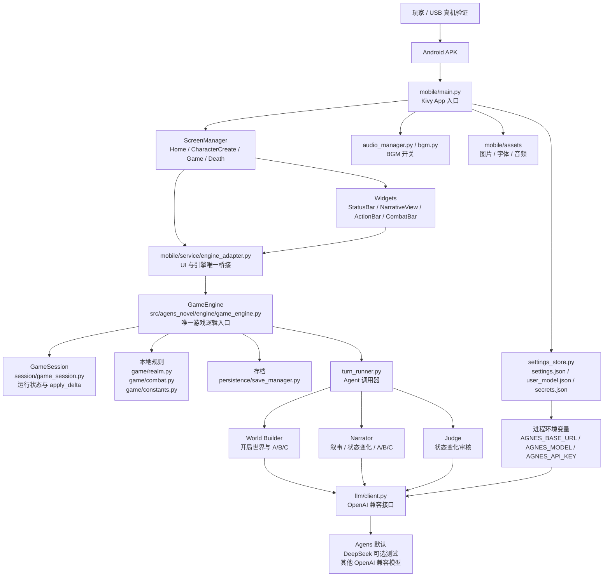
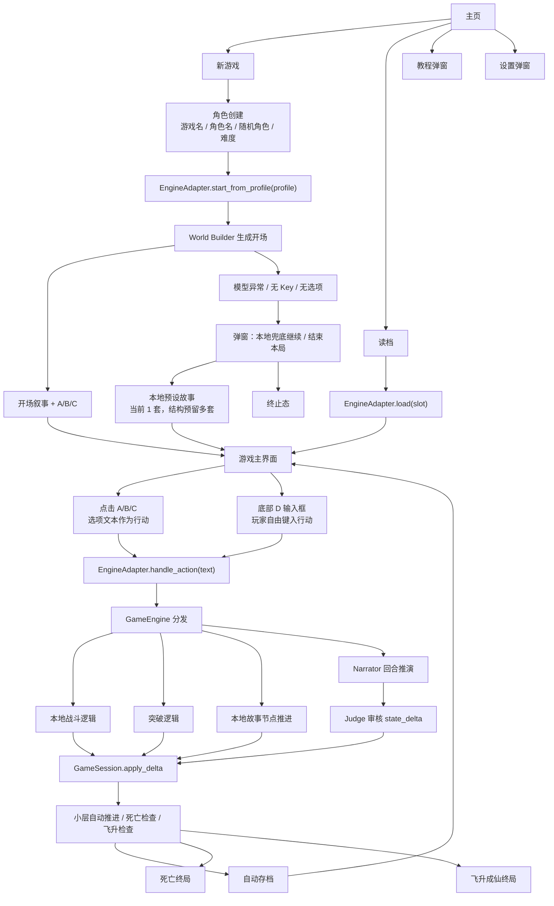
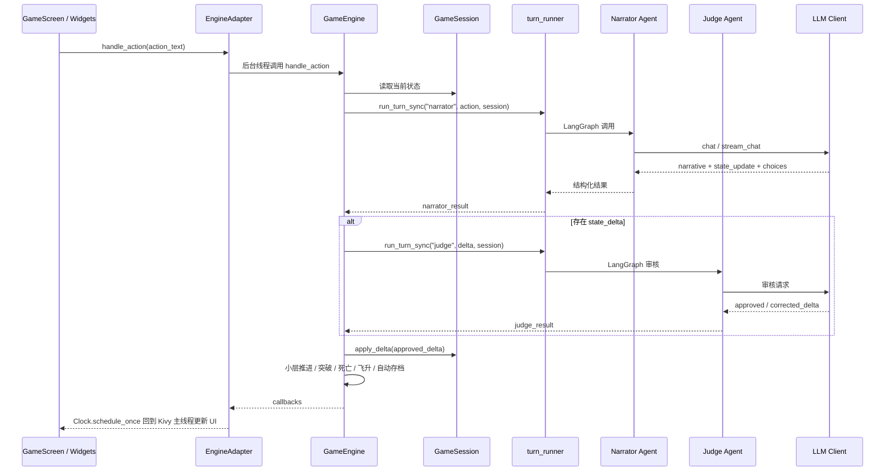
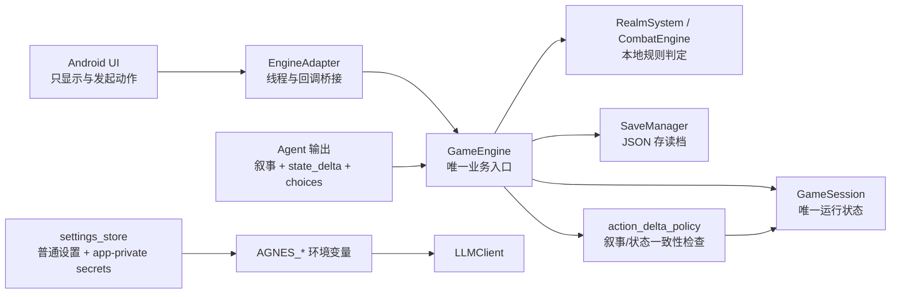
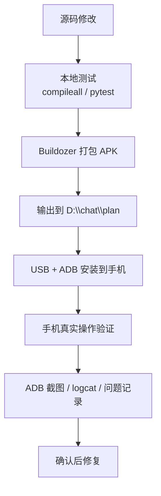

# 项目整体架构图

本文只描述当前实际架构：Android/Kivy 单入口、A/B/C/D 单一游玩模式、三 Agent 协作、USB 真机验证。不包含已废弃的 CLI/REPL、三自由度模式、桌面点击验证路线。

## 1. 总体分层

## 2. 游戏主流程

## 3. 单回合调用链

## 4. 数据归属

核心约束：

- Android UI 不直接修改 `GameSession`。
- 状态只能通过 `GameSession.apply_delta()`、`RealmSystem`、突破逻辑和本地战斗逻辑改变。
- 当前只开放引导模式：A/B/C 由模型基于上下文生成，D 始终是玩家输入。
- 角色创建页保留小说模式、游戏模式灰色入口，但不可点击，不进入运行逻辑。
- 模型失败或无选项时，用户确认后进入本地预设故事；本地故事仍复用 `GameSession.apply_delta()`、`RealmSystem`、存读档和现有 UI 回调。
- API key 不写入仓库、文档、日志或普通设置文件。

三层理解与代码映射：

- 交互层：`mobile/screens/*`、`mobile/widgets/*`、`EngineAdapter`，负责展示 A/B/C/D、弹窗和用户输入。
- 校验层：`Judge`、`action_delta_policy.py`、`RealmSystem`、本地故事节点条件，负责判断状态变化是否能生效。
- 状态/记忆层：`GameSession`、`SaveManager`，负责角色、世界、回合、存档和本地故事节点位置。

## 5. 模块职责速览

| 层 | 关键文件 | 职责 |
| --- | --- | --- |
| Android 入口 | `mobile/main.py` | Kivy App 启动、路径、字体、主题、设置、Screen 注册 |
| Android 页面 | `mobile/screens/*.py` | 主页、角色创建、游戏主界面、死亡/飞升终局 |
| Android 组件 | `mobile/widgets/*.py` | 状态栏、叙事区、A/B/C、D 输入栏、战斗提示 |
| UI 桥接 | `mobile/service/engine_adapter.py` | 后台线程执行引擎，回调切回 Kivy 主线程 |
| 设置 | `mobile/service/settings_store.py` | 普通设置、模型配置、app-private key、环境变量注入 |
| 引擎 | `src/agens_novel/engine/game_engine.py` | 游戏主循环、动作分发、回调、自动存档、终局 |
| 选项策略 | `src/agens_novel/engine/choices.py` | 模型选项清洗、本地兜底 A/B/C |
| 本地故事 | `src/agens_novel/engine/local_story.py` | 无模型/模型失败后的预设故事节点、A/B/C 推进、D 关键词匹配 |
| 模型结果分类 | `src/agens_novel/engine/model_result.py` | 请求失败、输出不完整、审核失败、本地兜底分类 |
| 状态一致性 | `src/agens_novel/engine/action_delta_policy.py` | 叙事声称获得/突破/接任务时校验结构化 delta |
| 会话 | `src/agens_novel/session/game_session.py` | 运行状态、状态变更、序列化 |
| 境界 | `src/agens_novel/game/realm.py` | 小层推进、突破资格、突破概率、飞升终态 |
| 战斗 | `src/agens_novel/game/combat.py` | 本地战斗状态机 |
| 存档 | `src/agens_novel/persistence/save_manager.py` | JSON 多槽位存档 |
| Agent 调用 | `src/agens_novel/engine/turn_runner.py` | 同步执行 LangGraph Agent |
| Agent | `src/agens_novel/agents/*` | World Builder / Narrator / Judge |
| LLM | `src/agens_novel/llm/client.py` | OpenAI 兼容 HTTP 调用 |

## 6. 验证与交付链路

固定边界：

- 产品验证只走 Android APK + USB 真机。
- 不再使用 Windows 桌面 Kivy 真实点击方案。
- 默认模型仍是 Agens；DeepSeek 是可选测试项。
- `D:\chat\plan` 是外部 APK 和证据目录，不属于仓库内容。
